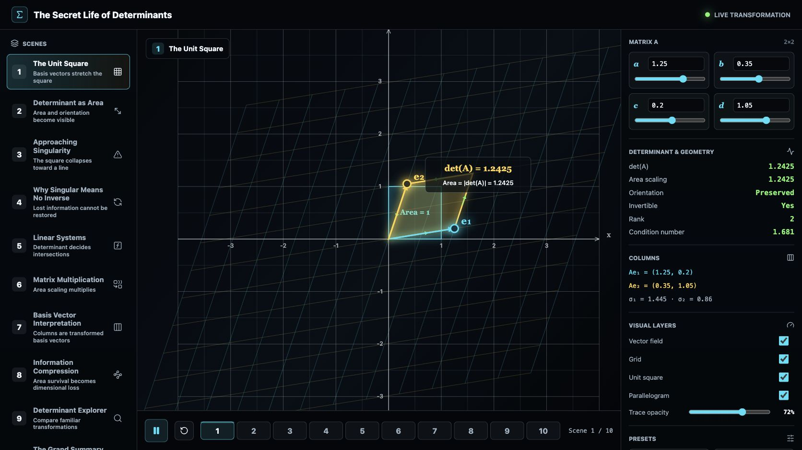
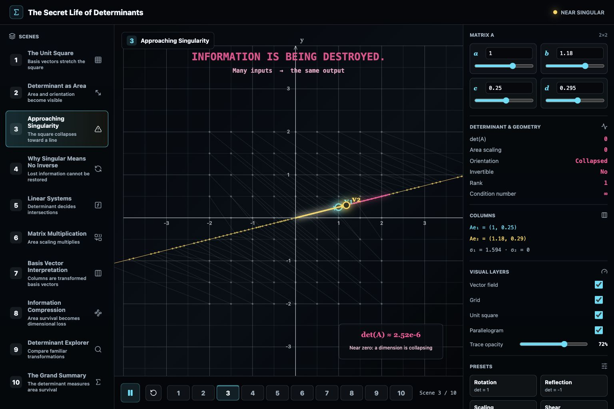

# The Secret Life of Determinants

An interactive mathematics visualization for senior high school and first-year university students. It builds geometric intuition for 2x2 matrices, determinants, singular matrices, inverse transformations, linear systems, matrix multiplication, basis vectors, rank, condition number, and information loss.

Live app: https://davidjpramsay.github.io/secret-life-of-determinants/

## Features

- Canvas-rendered Cartesian plane, basis vectors, transformed unit square, parallelogram area, and transformed grid.
- Live 2x2 matrix sliders and numeric inputs.
- Determinant, area scaling, orientation, rank, invertibility, singular values, and condition number readouts.
- Ten guided scenes: unit square, determinant as area, singularity, no inverse, linear systems, multiplication, basis vectors, information compression, explorer, and summary.
- Draggable basis-vector handles on the canvas.
- Responsive dark interface for desktop and mobile.

## Local Development

```bash
npm install
npm run dev
```

Build:

```bash
npm run build
```

## Visual Reference




